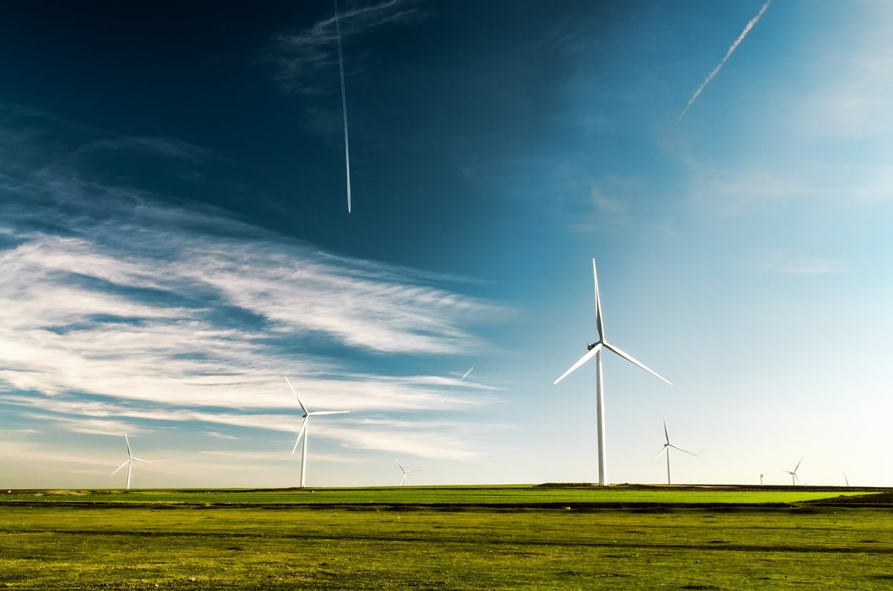

# Hands-on instructions

Install required software

```bash
sudo apt get install texlive
sudo apt install texlive-xetex
sudo apt install texlive-latex-recommended
```

`sudo apt get install texlive-fonts-extra` (maybe required for fonts)

Clone the theme repo

```
git clone git@github.com:rl-institut/beamer_theme.git
```

Checkout the slides' source file of this talk: <https://github.com/gplssm/slides_introducing_latex_beamer_theme/blob/master/20191216_introducing_latex_beamer_plessmann.md>


# Agenda

>#. Why? And what is \LaTeX{} beamer?
>#. How to use the theme `rli`
>#. More examples
>#. Outlook and how to contribute

# What is \LaTeX{} beamer?

\center
\onslide<2>{\includegraphics[width=.6\paperwidth]{img/what_is_latex_beamer_answered_wolfram-alpha.png}}

# What is \LaTeX{} beamer?

\center
\includegraphics[height=.85\paperheight]{img/what_is_latex_beamer_answered_google.png}

# What is \LaTeX{} beamer?

- Document class for \LaTeX{}
- Styled by themes
- Common \LaTeX{} features


# What is a beamer theme?

Sets the appearance for the slides

- Header and footer
- Fonts and color
- Title page
- Other defaults

As example, the beamer the _Berlin_

\begin{figure}
\begin{minipage}{0.2\textwidth}
\centering
\includegraphics[height=2.5cm]{img/Berlin-default-default-01.png}%
\end{minipage}%
\begin{minipage}{0.2\textwidth}
\centering
\includegraphics[height=2.5cm]{img/Berlin-default-default-02.png}%
\end{minipage}%
\begin{minipage}{0.2\textwidth}
\centering
\includegraphics[height=2.5cm]{img/Berlin-default-default-12.png}%
\end{minipage}%
\begin{minipage}{0.2\textwidth}
\centering
\includegraphics[height=2.5cm]{img/Berlin-default-default-17.png}%
\end{minipage}%
\begin{minipage}{0.2\textwidth}
\centering
\includegraphics[height=2.5cm]{img/Berlin-default-default-18.png}%
\end{minipage}%
\end{figure}

# Why is \LaTeX{} beamer good?

#. Content is separated from layout
#. Good typesetting, good defaults, nice math rendering
#. Source files (`.tex` or `.md`) is a text file, versionable, and gitable
#. Persistent design
#. Reusability of slides
#. Collaborative slides creation via GitHub
#. Theme can be improved by time

# Why markdown (through pandoc) is better!

#. Less formatting code
#. Simpler than \LaTeX{}
#. Popular markup language (GitHub, Redmine, Wikis)
#. Native \LaTeX{} code is always possible

# A minimal \LaTeX{} presentation

```latex
\documentclass[aspectratio=169]{beamer}

\usetheme{rli}
\title{Title}

\begin{document}
\frame{\titlepage}
\end{document}
```

compiled by 

```bash
xelatex slides.tex
```

# A minimal markdown presentation

A `slides.md` file containing the front matter

```markdown
---
title: Title
classoption: aspectratio=169
theme: rli
---
```

compiled by 

```bash
pandoc -t beamer --pdf-engine=xelatex -o slides.pdf slides.md
```

# Both results in ...

\center
{ width=90% }

# A more senseful front matter

```markdown
---
author: Author Name
title: Title
subtitle: Subtitle
institute: Reiner Lemoine Institut
classoption: aspectratio=169
date: \today
theme: rli
urlcolor: rlilinkcolor
---
```


# Slide examples

See the [example slides](https://github.com/rl-institut/beamer_theme/blob/master/example-slides.md) in the theme repository: <https://github.com/rl-institut/beamer_theme/>

# A new frame

Create a new frame with title and content

~~~ markdown
# A new frame

With content in its body.
~~~


# Use formatting syntax

The _quick_ **brown** fox ^jumps^ ~over~ the `lazy` ``dog``~~, not the cat~~.

You can also quote it

> The quick brown fox jumps over the lazy dog, not the cat.

Moreover, you can simply write \LaTeX{} code in .md files.


# Use lists and enumerated lists

- item a
  - item a.1
    - item a.1.a
    - item a.1.b
	
#. item 1
   #. item a
#. item 2
#. item 3
   - mix
   - it

# Descriptions

\blinddescription[3]


# Insert images

\center
{ width=75% }

# Presenting code

~~~ python
import requests
import pandas as pd
from tabulate import tabulate

df = pd.DataFrame(requests.get('http://openenergy-platform.org/api/v0\
  /schema/supply/tables/bnetza_eeg_anlagenstammdaten/rows/?limit=100').json())

df = df[[
  '4.11_bundesland',
  '4.1_energieträger', 
  '4.2_installierte_leistung',
  '4.16_name_des_netzbetreibers']]
df.columns = ["Federal state", "Technology", "Inst. Power", "Grid operator"]

print(tabulate(df.head(10), tablefmt="pipe", headers="keys"))
~~~

# Tables

|    | Federal state       | Technology   |   Inst. Power | Grid operator                       |
|---:|:--------------------|:-------------|--------------:|:------------------------------------|
|  0 | Niedersachsen       | Biomasse     |           366 | Avacon AG                           |
|  1 | Bayern              | Biomasse     |           380 | Bayernwerk AG                       |
|  2 | Bayern              | Wasserkraft  |             6 | Bayernwerk AG                       |
|  3 | Hessen              | Biomasse     |           380 | EnergieNetz Mitte GmbH              |
|  4 | Bayern              | Wind Land    |          3050 | Bayernwerk AG                       |
|  5 | Nordrhein-Westfalen | Biomasse     |           400 | Westfalen Weser Netz GmbH           |
|  6 | Nordrhein-Westfalen | Biomasse     |          1200 | Westfalen Weser Netz GmbH           |
|  7 | Schleswig-Holstein  | Wind Land    |          2000 | Schleswig-Holstein Netz AG          |
|  8 | Hessen              | Biomasse     |           400 | EnergieNetz Mitte GmbH              |
|  9 | Bayern              | Biomasse     |          1000 | MDN Main-Donau Netzgesellschaft mbH |

# Math

[SinkDSM](https://oemof.readthedocs.io/en/stable/oemof_solph.html#oemof-solph-custom-sinkdsm-label) following "On the representation of demand-side management in power system models" by Zerrahn & Schill (2015)
\vspace{-1ex}
\begin{align}
\onslide<1->{\quad \dot{E}_{t} = demand_{t} + DSM_{t}^{up} - \sum_{tt=t-L}^{t+L} DSM_{t,tt}^{do}  \quad \forall t \in \mathbb{T}\\}
\onslide<2->{\quad DSM_{t}^{up} = \sum_{tt=t-L}^{t+L} DSM_{t,tt}^{do} \quad \forall t \in \mathbb{T}\\}
\onslide<3->{\quad DSM_{t}^{up} \leq  E_{t}^{up} \quad \forall t \in \mathbb{T}\\}
\onslide<4->{\quad \sum_{t=tt-L}^{tt+L} DSM_{t,tt}^{do}  \leq E_{tt}^{do} \quad \forall tt \in \mathbb{T}\\}
\onslide<5>{\quad DSM_{t}^{up}  + \sum_{t=tt-L}^{tt+L} DSM_{t,tt}^{do} \leq max \{ E_{tt}^{up}, E_{tt}^{do} \}\quad \forall tt \in \mathbb{T}\\}
\notag
\end{align}


# Blocks

## Block header

Block content

# Use columns to organize your content

:::::: {.columns}
::: {.column  width=55%}
\includegraphics[width=\textwidth]{example-image-a}
:::

::: {.column  width=45%}
>- Explain
>- what's
>- to
>- see
:::
::::::

# Aligning images

\begin{figure}
\begin{minipage}{0.3\textwidth}
\centering
\includegraphics[height=2.5cm]{example-image-a}%
\end{minipage}%
\begin{minipage}{0.3\textwidth}
\centering
\includegraphics[height=2.5 cm]{example-image-b}%
\end{minipage}%
\begin{minipage}{0.3\textwidth}
\centering
\includegraphics[height=2.5 cm]{example-image-c}%
\end{minipage}%

\begin{minipage}{0.45\textwidth}
\centering
\includegraphics[height=2.5 cm]{example-image-a}%
\end{minipage}%
\begin{minipage}{0.45\textwidth}
\centering
\includegraphics[height=2.5 cm]{example-image-b}%
\end{minipage}%
\end{figure}


# Drawing with Tikz: animated energy system block diagram

:::::: {.columns}
::: {.column  width=45%} 
\begin{tikzpicture}

\tikzstyle{icon} = [inner sep=0pt];
\tikzstyle{flow} = [ultra thick, inner sep=0pt];

\coordinate (busTop) at (0.5\paperwidth,0.8\paperheight);
\coordinate (busBottom) at (0.5\paperwidth,0.3\paperheight);

\node (elecbus) at ($(busBottom) - (0,.5)$) {Household busbar};
\draw[line width=4pt](busTop) -- (busBottom);


\node[icon,draw,very thick, rounded corners=0.5ex, inner sep=3pt,visible on=<5->](dsm) at ($(busTop)!0.5!(busBottom) - (1,0)$) {{\visible<5->{\includegraphics[width=.8cm]{img/noun_filter_1653638.pdf}}}};
\node[icon](demand) at ($(busTop)!0.5!(busBottom) - (2.5,0)$) {{\visible<2->{\includegraphics[width=1.1cm]{img/Verbraucher_Haushalt_Strom.pdf}}}};
\node[icon](grid) at ($(busTop)!0.7!(busBottom) + (1,0)$) {{\visible<4->{\includegraphics[width=1.1cm]{img/Transport_Strom.pdf}}}};
\node[icon](pv) at ($(busTop)!0.3!(busBottom) + (1,0)$) {{\visible<3->{\includegraphics[width=1.1cm]{img/Stromerzeuger_Photovoltaik_Dachanlage.pdf}}}};

\draw[<-,flow, visible on=<5->](dsm) -- ($(busTop)!0.5!(busBottom)$);
\draw[->,flow, visible on=<5->](dsm) -- (demand);
\draw[<-,flow, visible on=<4->] ($(busTop)!0.7!(busBottom) + (2pt,0)$) -- (grid);
\draw[<-,flow, visible on=<3->] ($(busTop)!0.3!(busBottom) + (2pt,0)$) -- (pv);


\end{tikzpicture}
:::

::: {.column  width=40%}
**Assuming we have a household including**

\begin{itemize}
\item<2-> Demand
\item<3-> PV
\item<4-> Grid connection
\item<5-> Demand-side management unit
\end{itemize}

:::
::::::


---

Frame with no title

# {.plain }

...or a plain one, even without footer.


# How to use the theme

- You need the `.sty` files and the `img/` folder right next to your `slides.md` file
- Recommended workflow
  - Have the clone of [https://github.com/rl-institut/beamer_theme/](https://github.com/rl-institut/beamer_theme/)
    
    ~~~ bash
    git clone git@github.com:rl-institut/beamer_theme.git
    ~~~
  - Keep it up-to-date
  - Copy required files to your slides path

    ~~~ bash
    cp -r beamer_theme/img/ beamer_theme/*.sty <path-of-slide.md> 
    ~~~


# Useful links

- Example slides:
  - Markdown: <https://github.com/rl-institut/beamer_theme/blob/master/example-slides.md>
  - Latex: <https://github.com/rl-institut/beamer_theme/blob/master/example-slides.tex>
- PDF version of example slides: ...
- Rocket Chat channel: ...

# Things to work on

#. Consisten font colors
#. Fail-safe build of lastslide (and more improvements)
#. Simplified replacement of title graphic
#. Option to integrate partner logos
#. Distribution of theme style files (`*.sty` and `img/`)

Most urgent fix requests are here: <https://github.com/rl-institut/beamer_theme/milestone/2>

Please file issues there.

# How to contribute

- Highly welcome!
- Diverse tasks: readme/user guide, fixes, new features, code quality improvements, example slides 
- Workflow: <https://github.com/rl-institut/beamer_theme/blob/master/CONTRIBUTING.md>
- At least: please submit issues ;-)

# {.plain}

\insertendpagecontent